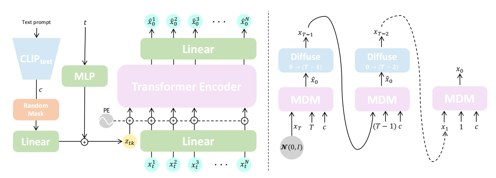

## Abstruct
现有的生成模型：生成的质量低，表达能力差
扩散模型：many-to-many nature，有希望成为 human motion 生成领域的候选方法，但是需要大量的训练且难以控制。

> [!note]
> 什么是 many-to-many nature？

在 motion generative 中，同一种条件可以生成许多不同的合理动作，不同的条件之间也可能映射到相似的动作分布。

扩散模型天然能够表达和学习多个条件 <-> 多种可能动作之间的复杂、多样映射关系。

MDM 基于 transformer，基于无分类器扩散模型。不预测噪声，而是预测样本本身。

> [!note]
> 什么是无分类器扩散模型？ Classifier-free diffusion models

sota：text-to-motion and action-to-motion

## Intro
Human motion generation 是计算机动画的一个基本任务。

## Related work

相关工作有：CLIP，Diffusion model

本文基于 CLIP 实现文本到动作的生成，方式和 T2I 类似。

## Motion Diffusion Model

整体思想是通过 condition $c$ 去生成一系列的帧。前文提到这可以是从一些以前的帧生成后续的帧，也可以是从两帧之间生成中间帧~~（拼好帧是你吗）~~。帧更准确的来说是 pose。

生成的结果：$x^{1:N} = \{x^i\}_{i=1}^{N}$，其中 $x^i \in \mathbb{R}^{J \times D}$，$J$ 是 joint （关节？）的数量，而 $D$ 是 joint 表示的维度。

左图是 MDM 的概览。可以看到 text prompt 经过 CLIP 生成文本嵌入 $c$，经过随机遮蔽后，与时间步 $t$ 一起编码为输入 token $z_{tk}$。然后就是注入位置编码，用 transformer encoder 去学习最终的 $\hat{x_0}$。

右图是采样的过程，采样过程类似于带条件 $c$ 的扩散模型。

## Experiments
作者做了三个实验：text-to-motion，action-to-motion，unconditioned generation。（训练用一张 2080 Ti 就可以，看起来可以搓一个试一下）

> [!note]
> text-to-motion 与 action-to-motion 的本质区别是什么？

## Discussion
局限性是单个结果需要 1000 步的迭代步骤（和 DDPM 的迭代步骤很像？）